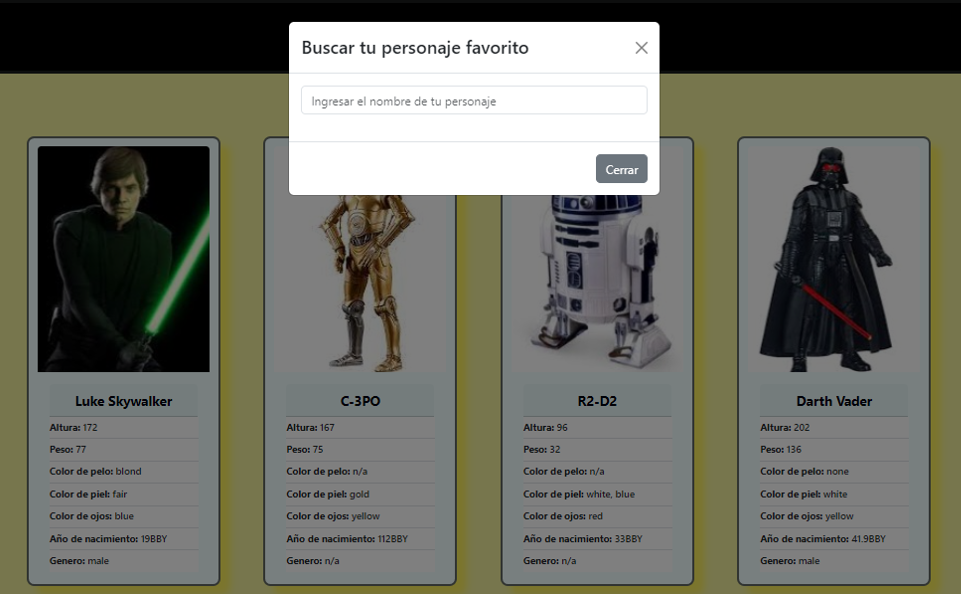

## React Challenge

## Joaquin Sebastian Zuin

------------

## Proyecto Start Wars Search People

El sistema permite traer todos los personaje de la URL (https://swapi.dev/) y buscar un personaje de la película de Start Wars.

# Instalación

Luego de clonar el repositorio, debe instalar la aplicacion mediante "npm install react-app" e iniciarla con "npm start". Se abrira el navegador  http://localhost:3000 para su visualizacion.

# Dependencias

- React
- React-Router-DOM 
- Axios
- UseContext para el manejo del contexto global
- React Bootstrap
- API de Star Wars (https://swapi.dev/)

# Descripción del proyecto
- El componente AppRoutes contiene el despliegue del sistema.
- La carpeta components contiene los componentes utilizados por la app. 
- Al componente HomePage se le dió la responsabilidad del acceso a la API de Star Wars (https://swapi.dev/). Como esta API no devuelve o no tiene la url de las imágenes de los personajes, se creó un arreglo de objetos en el contexto global, dentro del componente anteriormente nombrado se armó una función para agregar la URL de las imágenes de los personajes de Start Wart al arreglo de objetos que se recibe de la API. Las imagenes agregaron en la carpeta public/img.

# Uso de la app

- El sistema cuando se inicia, presenta la vista principal con un listado de carts con los personajes. 

- Desde la vista principal, seleccionando en el botón  con el texto (Buscar un Personaje de Star Wars), despliega un formulario modal.

- Clickeando en el campo del formulario modal los datos del personaje (puede ser por nombre, por altura o por calquiera de los campos que muestra la tarjeta), permite seleccionarlo.

- Al cerrar el formulario con el botón cerrar nos muestra la tarjeta del personaje que seleccionamos.

# Deploy

Puede ejecutar el proyecto desde el siguiente link:
[https://people-start-wars.vercel.app/](https://people-start-wars.vercel.app/)

#

